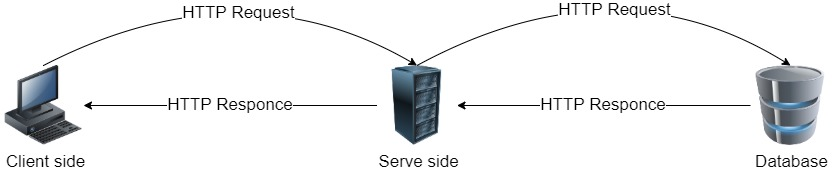
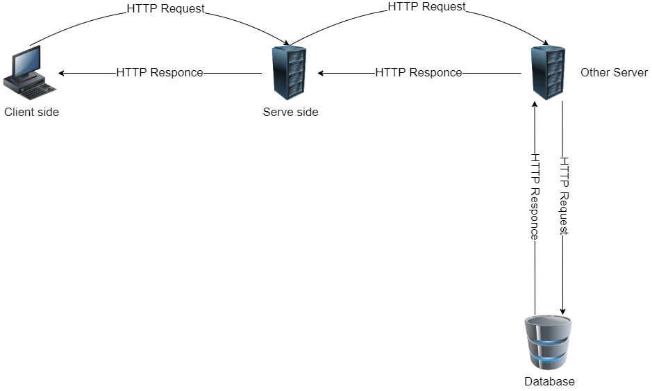

# Movies-Library - 1.0.0v

**Author Name**: Nedal AL-Qaisi

## WRRC

## Overview

## Getting Started
- A framework has been created under the name express
- All required files have been prepared
- The home page and favorite page have been linked to the server
## Project Features
- Movie database created.
- A function has been made so that we can store on the database.
- A function has been made so that we can retrieve and view the stored data.